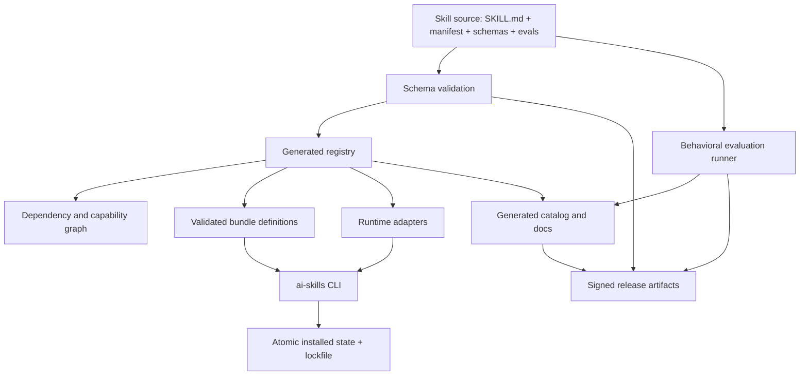

# Target System Architecture

## Architecture Goal

Create a single-direction derivation chain:

```text
Skill source → validated manifest → generated registry → bundles → adapters → docs → releases
```

No derived artifact may become a second source of truth.

## Target Architecture



## Canonical Components

### Skill Source

Each skill owns:

```text
<skill>/
├── SKILL.md
├── manifest.yaml
├── interface.schema.json       # agents/workflows as needed
├── output.schema.json          # when structured output is promised
├── evals/
│   ├── happy-path.yaml
│   ├── negative-routing.yaml
│   └── safety.yaml
├── examples/
└── references/
```

### Manifest Compiler

A Python package:

- validates manifests;
- verifies paths and names;
- computes digests;
- resolves dependencies and conflicts;
- generates registry and documentation fragments;
- emits compatibility artifacts.

### Registry

The registry is generated and committed for human review, but never manually edited.

### Bundle Resolver

Reads bundle YAML and resolves:

- exact skill IDs;
- version constraints;
- transitive dependencies;
- conflicts;
- hooks and approval requirements;
- runtime compatibility.

### Runtime Adapters

Transform neutral skill source into target format. An adapter may add runtime metadata but cannot weaken core safety policy.

### CLI

Recommended commands:

```text
ai-skills list
ai-skills search <query>
ai-skills inspect <id>
ai-skills bundle inspect <name>
ai-skills install <id|bundle>
ai-skills install --dry-run ...
ai-skills verify
ai-skills doctor
ai-skills update
ai-skills rollback
ai-skills uninstall
ai-skills eval
ai-skills registry build
ai-skills docs build
```

## Design Layers Review

### Layer 1 — Content Design

Strong, but mixed v1/v2 formats. Standardize routing, constraints, verification, examples, and versioning.

### Layer 2 — Contract Design

Promising, especially in advanced schemas. Replace informal YAML conventions with validated interchange schemas.

### Layer 3 — Orchestration Design

Good conceptual workflows. Add dependency typing, state transitions, checkpoint contracts, and failure semantics.

### Layer 4 — Distribution Design

Weakest current layer. Replace hard-coded Bash catalogs with a transaction-safe resolver.

### Layer 5 — Trust Design

Incomplete. Separate prompt content, tool-enabled agents, workflows, and executable hooks into distinct permission classes.

### Layer 6 — Quality Design

Structural checks exist; behavioral evidence is missing. Add evals, regression baselines, and release gates.

### Layer 7 — Documentation Design

Substantial authored material, but manually maintained reference data causes drift. Generate catalogs and preserve authored conceptual guides.

## Architectural Invariants

1. A skill ID is globally unique.
2. A registry entry is generated from a valid skill source.
3. A bundle cannot reference an unknown or incompatible skill.
4. Installation never deletes an unowned path.
5. Hooks require explicit approval.
6. Stable skills have passing contract and behavioral evals.
7. Documentation counts and tables are generated.
8. Every release has a reproducible registry and digests.
9. Runtime adapters cannot broaden permissions silently.
10. Warnings are not permitted in the stable release lane.
