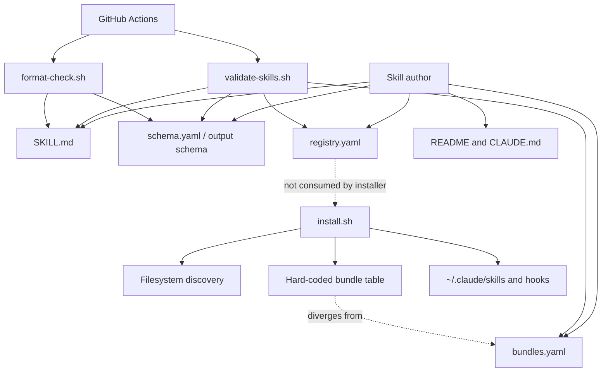

# Existing Architecture

## System Summary

The repository is a content-driven package system. Markdown and YAML artifacts define model behavior and agent interfaces. Bash scripts validate and install the content. The registry and bundle files are intended to coordinate discovery, but the runtime installer duplicates those definitions.

## Current Architecture Diagram

## Architectural Strengths

- Content is readable, portable, and version-controlled.
- Personas, agents, and workflows are conceptually separated.
- Typed agent schemas exist.
- Risk and consensus ideas are already present.
- Bundles provide task-level product packaging.
- CI and local validation exist.
- Advanced v2 schemas demonstrate a path toward mature contracts.

## Architectural Weaknesses

- Multiple manually maintained sources define the same truth.
- Registry statistics are stored rather than computed.
- Installer ignores the authoritative-looking bundle YAML.
- Structural validation is not strict enough to protect contracts.
- Behavioral correctness is not tested.
- Framework-specific metadata is mixed into the core format.
- Hooks and skills share distribution without a formal trust boundary.
- Documentation tables are manually curated and stale.
- Skill maturity states are absent.
- No generated lockfile records what a user installed.

## Current vs Intended Architecture

| Concern | Current | Intended |
|---|---|---|
| Metadata source | SKILL, registry, README, installer | Per-skill manifest |
| Registry | Hand-maintained | Generated and validated |
| Bundles | YAML plus Bash case table | YAML consumed by CLI |
| Documentation | Hand-maintained | Generated reference plus authored guides |
| Quality | Syntax and presence | Contract, integration, behavior, security |
| Installation | Destructive copy/remove | Atomic, reversible, manifest-tracked |
| Portability | Claimed | Adapter-tested |
| Release | Repository commits | Versioned signed artifacts |
